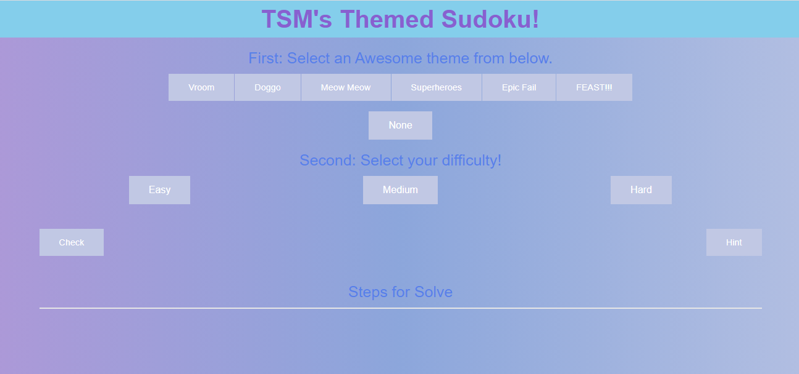
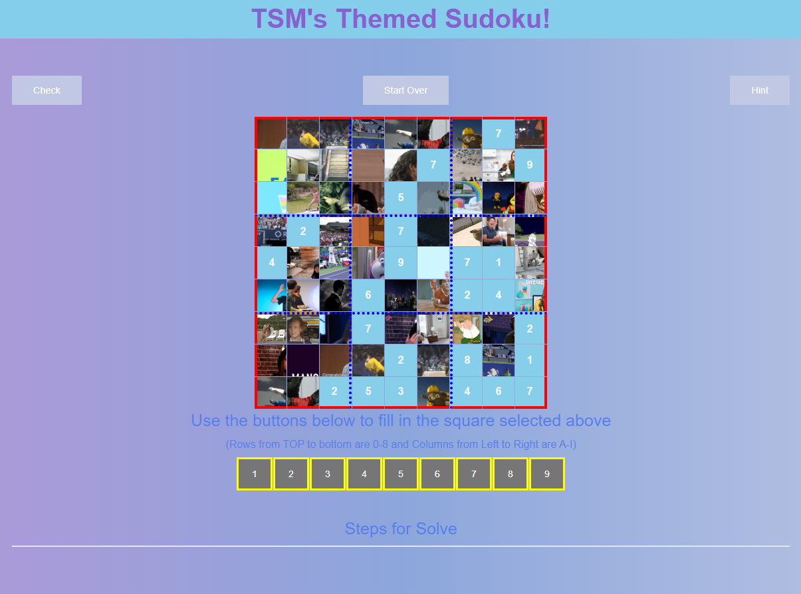

# Sudoku With a Twist!

Sudoku is a very popular and unique game. If you are one of the millions or people that enjoy this "logic challenging" game, then you have definitely played multiple games over the years. Many Sudoku players have favorite Apps or websites that they use to get their Sudoku fix. If you are looking for a fun version of Sudoku to pass your time, look no further! Here is your solution.

## TSM's Themed Sudoku

TSM's Themed Sudoku is a new and innovative way for you to enjoy your Sudoku "brain building" skills, with some hilarious background images to tickle your funny bone. Most Sudoku boards have the traditional "numbers given to you" filled in and the blank spaces as, well....blanks. With TSM's Themed Sudoku, not only can you select your difficulty level (easy, medium and hard), but you will also be able to select one of six themes. The blank spaces of the board will be filled with individual gifs/memes pertaining to the theme you selected. Once you select a cell and fill in a number, the background will go away, but the untouched cells will still show your fun theme for your entertainment.

You can use TSM's Themed Sudoku here:
https://code-monkey713.github.io/project-one/

## Usage

Upon arriving at TSM's Themed Sudoku site, the playing board will not be viewable. Some selections must be done before gameplay starts:

- First, a theme needs to be selected. Gifs of the theme you select will fill the number cells that are empty. When you click in the "empty cell" to enter a number, the background will go away.
- If you choose the theme "NONE," then there will be no backgrounds filled in. HOWEVER, you will now have the option to use an "interactive mode" which will give you hints for numbers to use in the empty cells.
- Next, you will choose what difficulty level you want your gameplay. Easy, Medium and Hard. More numbers are given to you at the start of an Easy game, and less numbers given as the difficulty level incleases.
- Once the difficulty level is selected, the gameboard will appear with your Sudoku board. Simply click in an "empty cell" (there will be a gif in the cell) and either enter a number with your keyboard or use the buttons below the board to fill in the desired number.
- Start your game and enjoy your Sudoku game while enjoying the gifs in the backgrounds.
- When you believe you have a solution to the board, click on the "CHECK" button. If your solution is correct, the "CHECK" button will light up green. If the solution is not correct, the "CHECK" button will turn red.
- Good luck!

## Screenshots

See the following SCREENSHOTS to get an idea of what the "TSM's Themed Sudoku" looks like:

For more information, please contact:

- Tony Tran via e-mail: codemonkey713@gmail.com
- Senyo Ahadzie via e-mail: Senyo.E.Ahadzie@rice.edu
- Michael Llanes via e-mail: llanesm@gmail.com

## Resources

The following technologies were used to create TSM's Themed Sudoku:

- JQuery and JavaScript: https://code.jquery.com/
- The FRAMEWORK used was ZURB Foundation: https://get.foundation/index.html
- The API used for the initial Sudoku number arrays was SUGOKU: https://sugoku2.herokuapp.com/
- The GIPHY API is what was used to pull the images for the blank cell backgrounds: https://developers.giphy.com/docs/sdk/

## License

There is no license associated with this app
